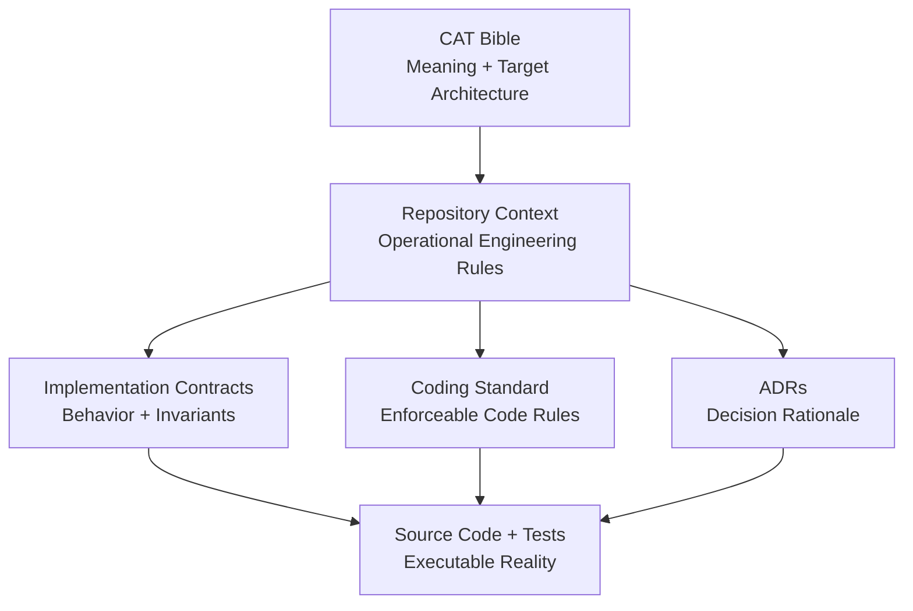

# CAT OMNISYSTEM Bible

> Canonical project-level knowledge system for CAT — Commerce AI Trinity.

**Status:** Foundation — actively expanding  
**Audience:** Human owner, architects, developers, AI coding agents, AI research agents, operators, future maintainers  
**Repository:** `afshin0095-lang/CAT`  
**Canonical implementation context:** `/context`  
**Canonical engineering standard:** `/context/14_CODING_STANDARD.md` and its append-only continuation  
**Canonical directory rules:** `/context/15_DIRECTORY_STRUCTURE.md`

---

## 1. Purpose

The CAT Bible is the long-lived semantic specification of the system. It explains **what CAT is, why it exists, how it thinks, what capabilities it owns, how its agents cooperate, how the technical architecture is organized, and how future changes must remain compatible with the original mission**.

The Bible is intentionally broader than API documentation or source-code comments. Source code explains implementation; contracts explain enforceable behavior; ADRs explain individual decisions; the Bible explains the **whole organism**.

An AI agent joining the repository should be able to read the Bible first and acquire enough context to avoid treating CAT as an ordinary affiliate script or CRUD application.

---

## 2. Source-of-truth hierarchy

When documents disagree, agents must use the following precedence:

| Priority | Source | Role |
|---:|---|---|
| 1 | Executable code + tests + database migrations | Current implemented behavior |
| 2 | Explicit implementation contracts | Enforceable interface/invariant definitions |
| 3 | Coding and directory standards | Repository-wide engineering rules |
| 4 | ADRs / decision records | Rationale for architectural choices |
| 5 | CAT Bible | System intent, architecture, capabilities and long-range design |
| 6 | Research notes / proposals | Candidate future ideas |

The Bible **must not silently rewrite implemented reality**. When a target capability is not implemented, it is described as `PLANNED`, `TARGET`, or `VISION`, never as completed functionality.

---

## 3. Documentation operating rules

### 3.1 Every major subsystem gets four views

For important domains, documentation should eventually provide:

1. **Conceptual view** — what the subsystem means.
2. **Architectural view** — where it lives and what it depends on.
3. **Behavioral view** — workflows, state transitions and failure modes.
4. **Contract view** — schemas, invariants, interfaces and compatibility rules.

### 3.2 AI-readable documentation

Documents should prefer:

- explicit terminology;
- stable identifiers;
- tables for responsibilities and invariants;
- Mermaid diagrams for relationships and flows;
- state machines for lifecycle-heavy components;
- examples that distinguish valid and invalid behavior;
- links to implementation contracts;
- clear `Implemented / Planned / Experimental / Deprecated` labels.

### 3.3 No accidental invention

If a capability is proposed but not yet implemented, the document must say so. Research material may inspire the target architecture, but it does not automatically become a CAT commitment.

---

## 4. Bible map

The Bible will grow in controlled stages. The initial map is:

```text
CAT OMNISYSTEM BIBLE
│
├── 00 — Vision & Identity
├── 01 — System Architecture
├── 02 — Agent Operating System
├── 03 — Capability Map
├── 04 — Knowledge & Memory
├── 05 — Affiliate Intelligence Engine
├── 06 — Content Factory
├── 07 — Advertising Operating System
├── 08 — Data Architecture
├── 09 — UI / UX / Control Plane
├── 10 — Security & Trust
├── 11 — Infrastructure & DevOps
├── 12 — APIs, Events & Integration
├── 13 — Persistence & Reliability
├── 14 — Evaluation, Learning & Optimization
├── 15 — Governance & Human-in-the-Loop
├── 16 — Roadmap & Evolution
└── 17 — Appendices / Glossary / Research Index
```

The structure is deliberately compatible with the earlier CAT research package, which proposed dedicated sections for vision, architecture, AI agents, knowledge brain, affiliate engine, content factory, advertising OS, data architecture, UI/UX, security, DevOps, roadmap, investor material and appendices. fileciteturn1047file0L1-L1

---

## 5. Relationship to `/context`

The repository already contains a more implementation-oriented context system. The Bible does not replace it.



The existing repository README already defines CAT as an autonomous AI commerce and affiliate operating system and lists the core principles of AI-first architecture, human approval for critical actions, modular agents, knowledge-driven improvement, security by design and cloud-native scalability. fileciteturn1046file0L2-L2

---

## 6. Current implementation boundary

The Rust workspace currently declares fifteen core packages spanning kernel, event bus, PostgreSQL event store, runtime, knowledge, memory, LLM, reasoning, decision, planning, orchestrator, platform, RAG, affiliate and content. fileciteturn1045file0L2-L2

This Bible therefore treats those packages as the **current architectural substrate**, while describing additional business capabilities as staged targets until their implementation exists.

---

## 7. Reading protocol for AI agents

Before modifying CAT, an AI agent should:

1. Read this index.
2. Read the relevant Bible chapter.
3. Read the matching `/context` document.
4. Read the relevant implementation contract.
5. Inspect actual source code and tests.
6. Identify whether the requested capability is implemented, partially implemented, or planned.
7. Preserve existing invariants unless an explicit architectural change is approved.
8. Add or update documentation when a new contract or architectural decision is introduced.

### AI comprehension rule

**Never infer permission from directory names, placeholders, examples, diagrams, or future architecture.** The repository's executable behavior and explicit contracts remain authoritative.

---

## 8. Documentation maturity model

| Level | Meaning |
|---|---|
| L0 | Idea only |
| L1 | Researched / documented |
| L2 | Architecture specified |
| L3 | Contract specified |
| L4 | Implemented |
| L5 | Tested and integrated |
| L6 | Operationally observed |
| L7 | Continuously optimized |

A capability should not be described as production-complete merely because its Bible chapter exists.

---

## 9. Long-term objective

CAT is designed to become a durable AI-native commerce organization in software form: a system capable of discovering economic opportunities, evaluating them, planning actions, generating and distributing content, managing affiliate relationships and advertising channels, measuring outcomes, learning from evidence, and continuously reallocating effort toward better outcomes.

The research foundation describes this as an autonomous affiliate business OS rather than a simple affiliate bot, with a long-term closed loop from discovery and content to advertising, analytics and revenue optimization. fileciteturn1047file0L1-L1

The implementation strategy is intentionally incremental: **build the smallest trustworthy kernel first, then add capabilities without breaking the kernel's durability, security, observability or provider independence.**
