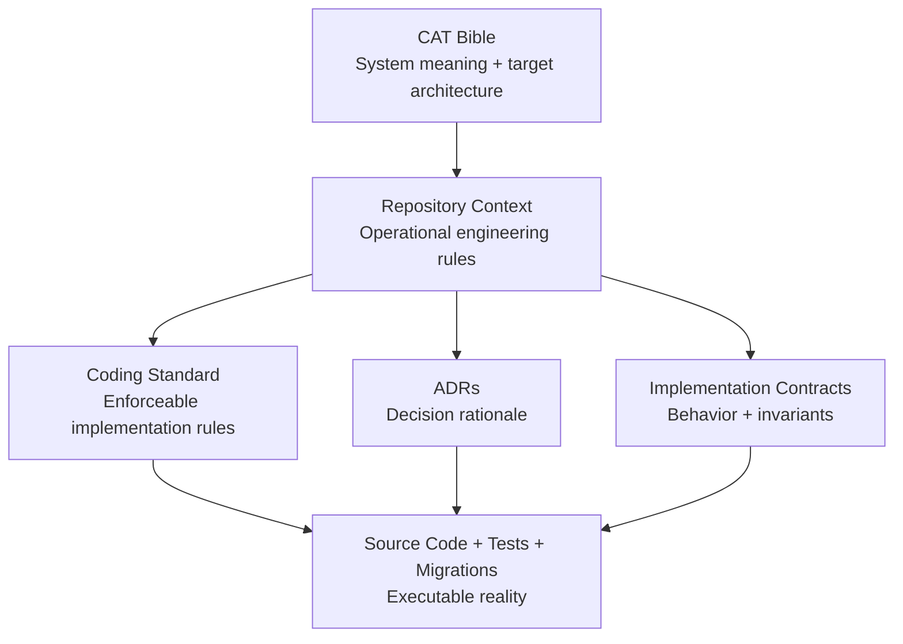
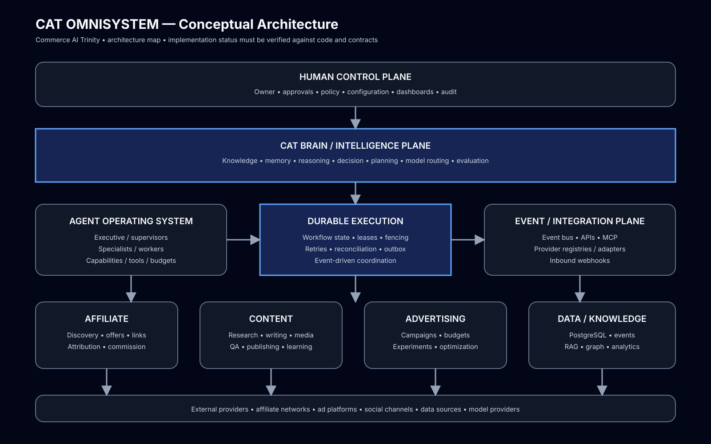

# CAT OMNISYSTEM Bible

> Canonical project-level knowledge system for CAT — Commerce AI Trinity.

**Status:** Foundation + domain architecture actively expanding  
**Audience:** Human owner, architects, developers, AI coding agents, AI research agents, operators, future maintainers  
**Repository:** `afshin0095-lang/CAT`  
**Canonical implementation context:** `/context`  
**Canonical engineering standard:** `/context/14_CODING_STANDARD.md` and its append-only continuation  
**Canonical directory rules:** `/context/15_DIRECTORY_STRUCTURE.md`

---

## 1. Purpose

The CAT Bible is the long-lived semantic specification of the system. It explains what CAT is, why it exists, how it thinks, what capabilities it owns, how its agents cooperate, how the technical architecture is organized, and how future changes must remain compatible with the original mission.

The Bible is broader than API documentation or source-code comments. Source code explains implementation; contracts define enforceable behavior; ADRs explain individual decisions; the Bible explains the whole organism.

An AI agent joining the repository should be able to read the Bible first and acquire enough context to avoid treating CAT as an ordinary affiliate script or CRUD application.

---

## 2. Source-of-truth hierarchy

| Priority | Source | Role |
|---:|---|---|
| 1 | Executable code + tests + database migrations | Current implemented behavior |
| 2 | Explicit implementation contracts | Enforceable interface/invariant definitions |
| 3 | Coding and directory standards | Repository-wide engineering rules |
| 4 | ADRs / decision records | Rationale for architectural choices |
| 5 | CAT Bible | System intent, architecture, capabilities and long-range design |
| 6 | Research notes / proposals | Candidate future ideas |

The Bible must never silently rewrite implemented reality. When a target capability is not implemented, it is labeled `PLANNED`, `TARGET`, `EXPERIMENTAL`, or `VISION` rather than described as complete.

---

## 3. AI-readable documentation rules

Every major subsystem should eventually have four views:

1. **Conceptual** — meaning and purpose.
2. **Architectural** — components and dependencies.
3. **Behavioral** — workflows, state transitions and failure modes.
4. **Contract** — schemas, invariants, interfaces and compatibility rules.

Documentation should use stable terminology, identifiers, tables, Mermaid diagrams, state machines, examples, implementation links, and explicit maturity labels.

### No accidental invention

Research can influence the target architecture, but research does not become implementation merely by appearing in the Bible. AI agents must inspect the real repository before coding.

---

## 4. Bible map

```text
CAT OMNISYSTEM BIBLE
│
├── 00 — Vision & Identity
├── 01 — System Architecture
├── 02 — Agent Operating System
├── 03 — Capability Map
├── 04 — Knowledge, Memory & Learning
├── 05 — Affiliate Intelligence Engine
├── 06 — Content Factory
├── 07 — Advertising Operating System
├── 08 — Data Architecture
├── 09 — Security, Trust & Governance
├── 10 — Infrastructure, DevOps & Scaling
├── 11 — APIs, Events & Integrations
├── 12 — Autonomy, Learning & Evaluation
├── 13 — Complete Agent Catalog
├── 14 — Revenue, Treasury & Economics
├── 15 — Control Plane, UI/UX & Human Operations
├── 16 — Persistence & Reliability
├── 17 — Governance & Human-in-the-Loop
├── 18 — Roadmap & Evolution
└── 19 — Appendices / Glossary / Research Index
```

### Current chapter files

- `00–04`: foundational identity, architecture, agents, capability map, knowledge/memory.
- `05`: affiliate discovery, offers, tracking, attribution, provider independence, economics.
- `06`: evidence-backed content and multimedia production pipeline.
- `07`: paid acquisition, campaigns, budgets, experimentation, optimization.
- `08`: data planes, lineage, identity, persistence, analytics and lifecycle.
- `09`: security zones, authorization, agent permissions, secrets, prompt security and audit.
- `10`: infrastructure topology, scaling, CI/CD, reliability, observability and cost engineering.
- `11`: APIs, events, connectors, MCP/tool boundaries and integration testing.
- `12`: autonomy levels, evaluation, simulation and governed self-improvement.
- `13`: executive, research, affiliate, content, advertising and platform agent taxonomy.
- `14`: revenue model, attribution economics, treasury boundaries and spend controls.
- `15`: operator control plane, approvals, dashboards, agent observability and UX principles.

---

## 5. Architecture relationship



The current Rust workspace defines fifteen core packages: kernel, eventbus, eventstore-postgres, runtime, knowledge, memory, llm, reasoning, decision, planning, orchestrator, platform, rag, affiliate, and content. The Bible treats these as the current implementation substrate and marks additional capabilities as targets until implemented.

---

## 6. Reading protocol for AI agents

Before modifying CAT:

1. Read this index.
2. Read the relevant Bible chapter.
3. Read the matching `/context` document.
4. Read the relevant implementation contract.
5. Inspect actual source code, tests and migrations.
6. Determine implementation maturity.
7. Preserve existing invariants unless an explicit architectural change is approved.
8. Update documentation whenever a new contract or architectural decision is introduced.

**AI comprehension rule:** Never infer permission from directory names, placeholders, diagrams, examples, or future architecture. Executable behavior and explicit contracts remain authoritative.

---

## 7. Documentation maturity model

| Level | Meaning |
|---|---|
| L0 | Idea only |
| L1 | Researched / documented |
| L2 | Architecture specified |
| L3 | Contract specified |
| L4 | Implemented |
| L5 | Tested and integrated |
| L6 | Operationally observed |
| L7 | Continuously optimized |

A chapter existing in this directory is never evidence by itself that the corresponding feature is production-complete.

---

## 8. Long-term objective

CAT is designed to become a durable AI-native commerce organization in software form: a system capable of discovering economic opportunities, evaluating them, planning actions, generating and distributing content, managing affiliate relationships and advertising channels, measuring outcomes, learning from evidence, and continuously reallocating effort toward better outcomes.

The implementation strategy is incremental: **build the smallest trustworthy kernel first, then add capabilities without breaking durability, security, observability, provider independence, or economic governance.**

---

## 9. Visual architecture



The SVG is intentionally text-rich and machine-readable so it can be rendered by documentation systems while remaining useful to multimodal AI systems.
