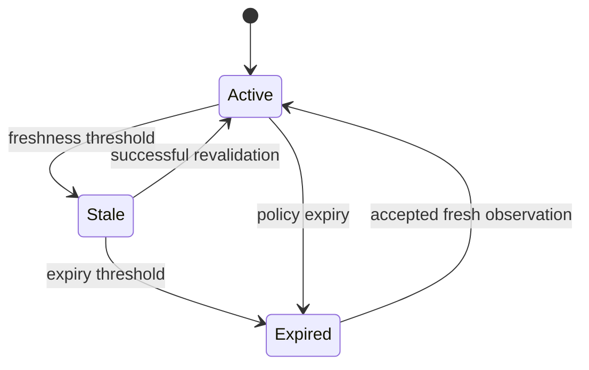
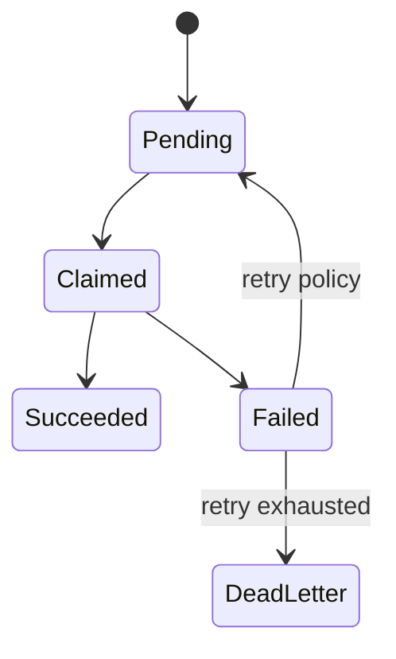

# D05 — State Machines

## Opportunity

## Revalidation request

## Agent run
`Created → Authorized → Running → Succeeded | Failed | Cancelled | Quarantined`.

Invalid transitions are rejected; state cannot be mutated by merely updating a projection.
