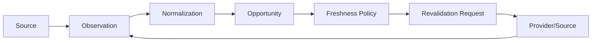

# D10 — Opportunity Domain

The Opportunity domain turns external observations into durable, queryable affiliate opportunities.

An opportunity owns stable identity, canonical key, source provenance, current revision and observed commercial attributes. Lifecycle is derived from freshness policy; it is not treated as an independently authoritative database fact.

Revalidation is durable work. Requests have reasons, priority, deduplication identity, claim state and attempts. Successful observations update authoritative facts and emit events only at actual domain boundaries.

Determinism, idempotency, optimistic concurrency and fail-closed temporal behavior are mandatory.
