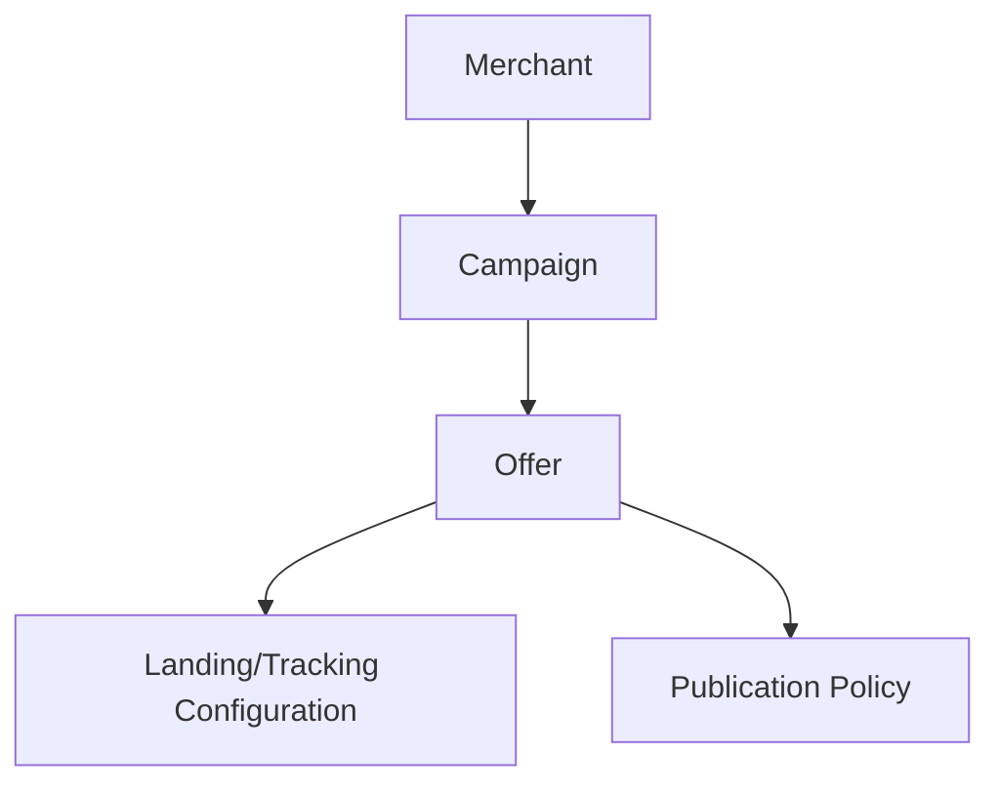

# D12 — Campaign Domain

Campaigns organize commercial intent and published offers.

A campaign owns its publication policy and groups offers. An offer references the affiliate network/provider representation but does not embed credentials. Publication requires validation, policy authorization and an auditable version.

Mutable drafts and immutable published versions are separate concepts. Rollback means selecting a known-good published version, not mutating historical evidence.
