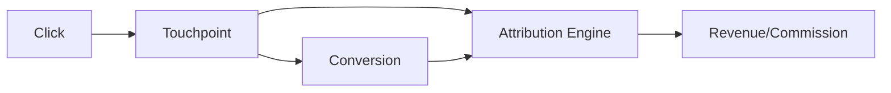

# D14 — Tracking & Attribution Domain

Tracking records behavioral facts; attribution creates a decision explaining which eligible touchpoint receives credit.

Click and conversion ingestion must be idempotent. Attribution stores the model/policy version, candidate touchpoints, selected result and evidence. Reprocessing the same event must not create duplicate economic side effects.

Privacy, retention, tenant isolation and consent policy apply before data becomes available to downstream agents.
