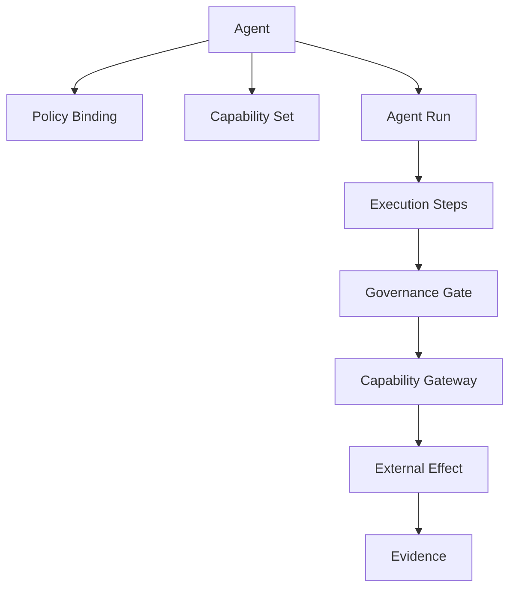

# D15 — Agent Domain

An Agent is a governed execution identity, not an unrestricted autonomous process.

Core concepts: agent definition, version, capabilities, policy bindings, budget, trust level, run, step, decision, approval and evidence.

Every run has correlation identity, authorization context, bounded resources and an explicit terminal result. High-risk actions may require human approval. Agents cannot directly access secret material or bypass capability gateways.
