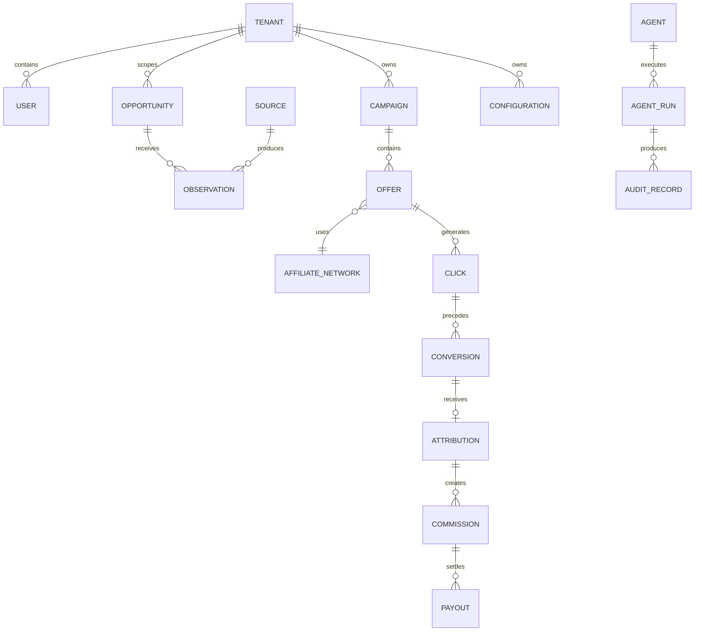

# D19 — Entity Relationship Model

Relationships are logical domain relationships. Physical database foreign keys and partitioning are implementation decisions governed by D20 and the technical architecture pack.
