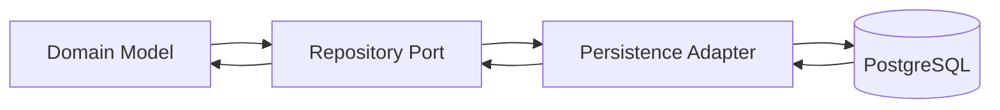

# D20 — Domain-to-Database Mapping

The database is a persistence mechanism, not the domain model.

| Domain concept | Persistence shape | Notes |
|---|---|---|
| Opportunity | opportunity + observation tables | facts persisted; lifecycle derived |
| Revalidation | request + attempt tables | unique dedup key and claim indexes |
| Campaign/Offer | campaign/offer/version tables | published versions immutable |
| Tracking | click/conversion/attribution tables | idempotency keys required |
| Revenue | commission/payout tables | integer minor units + currency |
| Agent | agent/run/step tables | execution evidence retained |
| Identity | tenant/user/principal tables | authorization scope indexed |
| Configuration | configuration/version tables | immutable published versions |
| Audit | append-oriented audit table | protected access and retention |

## Persistence rules

- Use parameterized SQL only.
- Use transactions where aggregate invariants span multiple writes.
- Use optimistic revision checks for concurrent mutable aggregates.
- Use unique constraints to enforce idempotency where possible.
- Never persist a derived state merely because a projection currently computes it.
- Migrations are additive and reversible where practical; destructive changes require explicit migration policy.
- Database errors map into the stable domain/application error taxonomy.

