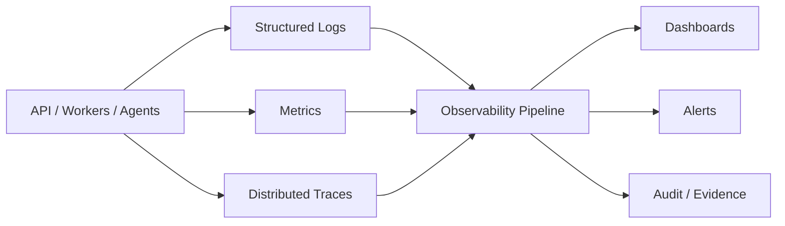

# O01 — Observability Architecture

CAT observability is a first-class cross-cutting capability spanning API, domain services, agents, queues, providers, persistence, and infrastructure.

Every meaningful operation should be correlatable across logs, metrics, and traces using a request/correlation ID. Observability must not expose secrets or unrestricted private payloads.

The architecture separates operational telemetry from business/audit records: telemetry supports system operation; audit records establish security and business evidence.
