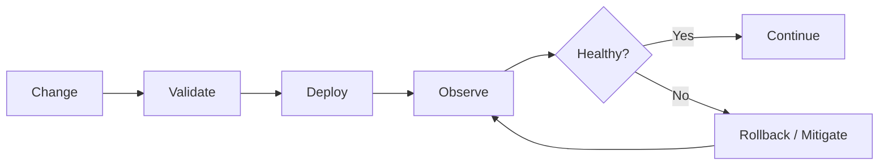

# O01 — Operations Principles

CAT operations are designed around deterministic behavior, explicit ownership, observable state, safe failure, and reversible change.

## Core rules

1. Every production operation has an owner.
2. Every asynchronous operation has a correlation ID.
3. Every externally visible state transition is observable.
4. Failures are classified before remediation.
5. Automation must have bounded retries and budgets.
6. Deployments must be reversible.
7. Recovery procedures are tested, not merely documented.

