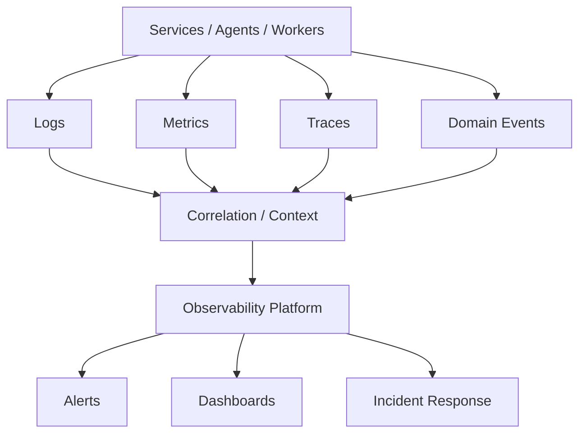

# O02 — Observability Architecture

CAT uses three primary telemetry signals: logs, metrics, and traces. Domain events provide business-level evidence and are distinct from infrastructure telemetry.

Telemetry must preserve tenant/resource boundaries and redact sensitive values.
