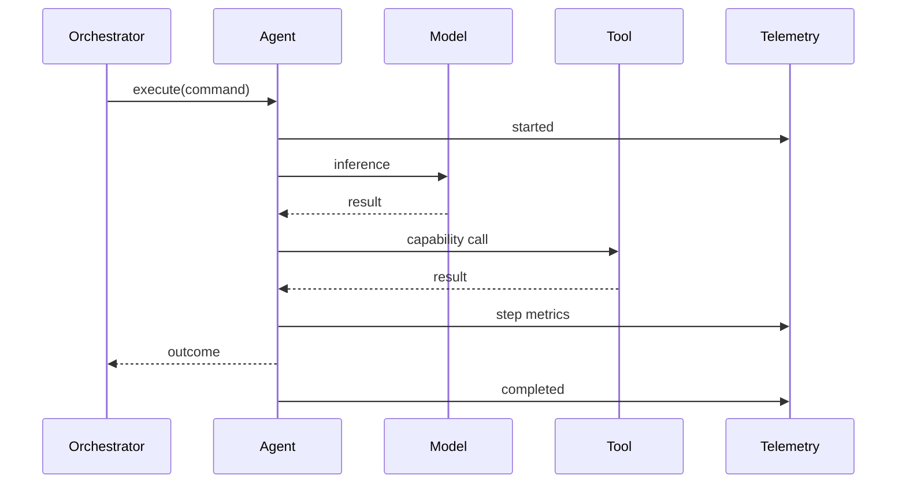

# O06 — Agent Telemetry

Every agent execution emits bounded operational telemetry.

Minimum fields include agent type/version, execution ID, command ID, duration, step count, model/provider identifiers, tool count, outcome, retry count, and bounded cost information. Prompt and response bodies are excluded unless an explicit controlled diagnostic policy permits their capture.
