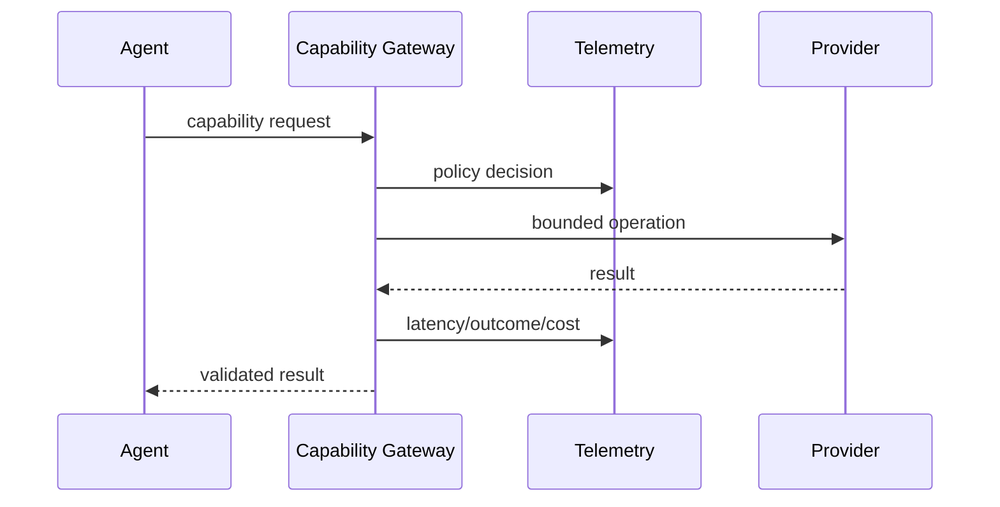

# O07 — Agent Telemetry

Agent telemetry makes autonomous execution inspectable without exposing prompts or secrets.

Record run ID, agent identity, capability, step count, latency, token/cost units, outcome class, retry count, and policy decisions. Store sensitive prompt/content payloads separately under explicit retention policy.
