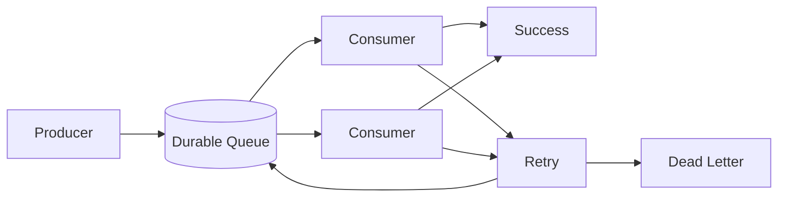

# O09 — Queue Operations

Queues are treated as durable execution infrastructure.

Key measurements:

- depth;
- oldest message age;
- throughput;
- processing latency;
- retry count;
- dead-letter count;
- visibility/lease expiry;
- consumer concurrency;
- claim conflicts;
- poison-message rate.

Queue consumers must be idempotent. A retry is not proof that the previous attempt did not execute; state transitions therefore require explicit idempotency and concurrency controls.
