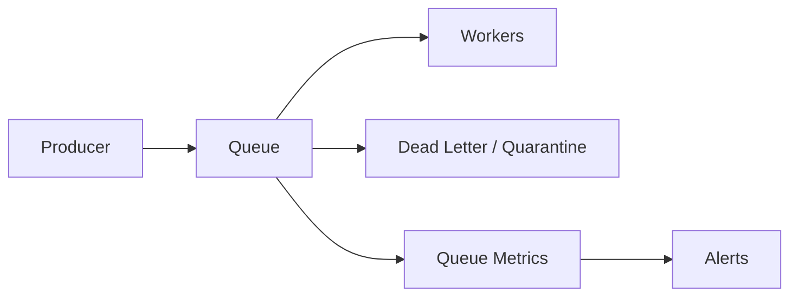

# O10 — Queue Monitoring

Queues are monitored as flow-control systems.

Monitor depth, oldest message age, enqueue/dequeue rate, processing latency, retry count, visibility timeout failures, poison-message rate, and dead-letter volume.

Alert thresholds must account for normal traffic patterns. A queue can be healthy at high depth if drain rate is sufficient; age and throughput are often more informative than depth alone.
