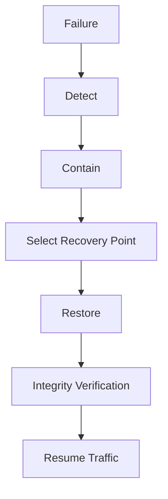

# O14 — Disaster Recovery

CAT recovery is designed around explicit failure domains.

Recovery planning covers database loss, queue loss, provider outage, region/host failure, credential compromise, deployment regression, and corrupted configuration.

RPO and RTO are deployment-specific values. The architecture therefore defines mechanisms and verification procedures rather than pretending one universal number fits every environment.
