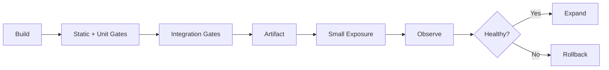

# O17 — Deployment Strategy

Deployments use progressive exposure whenever operationally practical.

Artifacts are immutable after release. Configuration and secrets are injected at runtime. Database migrations must be backward-compatible across the deployment boundary or explicitly coordinated.
