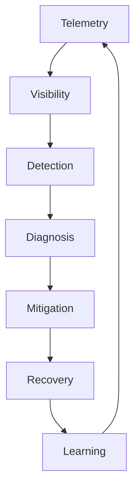

# O20 — Operations Roadmap

Operations maturity is implemented in layers.

| Phase | Capability |
|---|---|
| O1 | structured logging + request correlation |
| O2 | metrics + health endpoints |
| O3 | distributed tracing |
| O4 | queue and worker telemetry |
| O5 | agent/provider/cost telemetry |
| O6 | SLOs, alerting, error budgets |
| O7 | backup/restore verification |
| O8 | progressive deployment + rollback |
| O9 | disaster recovery exercises |
| O10 | automated reliability policy |

The objective is not maximum telemetry volume. The objective is enough trustworthy evidence to operate CAT safely and understand why a decision or failure occurred.
