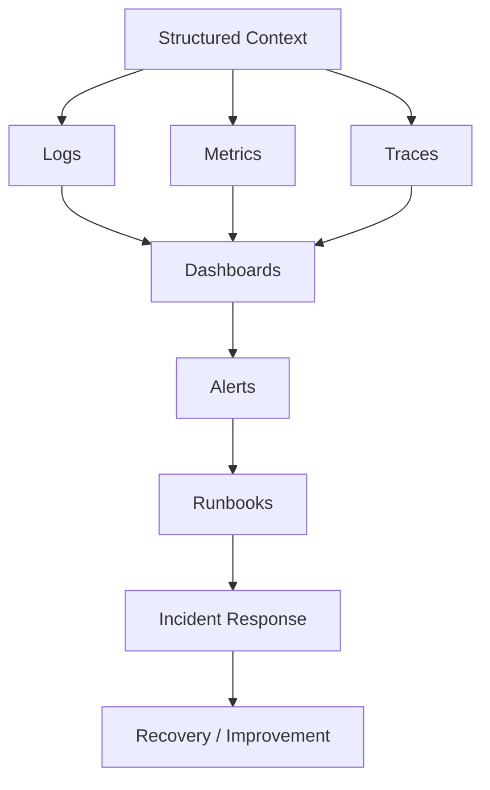

# O20 — Operations Implementation Roadmap

```mermaid
flowchart TD
  A[Structured Context] --> B[Logs]
  A --> C[Metrics]
  A --> D[Traces]
  B --> E[Dashboards]
  C --> E
  D --> E
  E --> F[Alerts]
  F --> G[Runbooks]
  G --> H[Incident Response]
  H --> I[Recovery / Improvement]
```

## Gates

**Gate 1:** request/correlation context exists before distributed features.

**Gate 2:** metrics and structured logs exist before autonomous workers.

**Gate 3:** traces and cost telemetry exist before large-scale agent execution.

**Gate 4:** alerts and runbooks exist before production automation.

**Gate 5:** backup/restore and rollback are exercised before critical financial workflows.

The implementation should add telemetry through stable interfaces so domain logic does not depend on a specific observability vendor.
